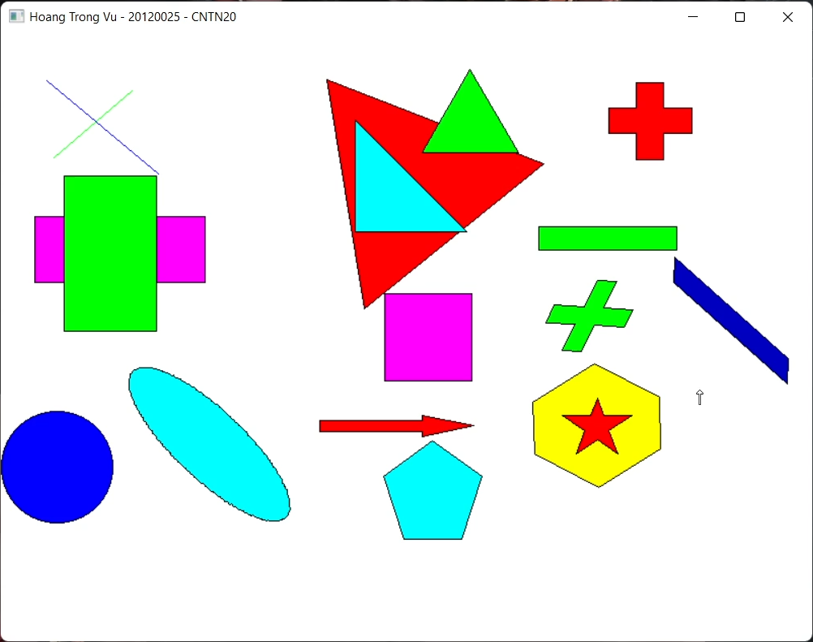

# 2D Computer Graphics

This is my project for 2D Computer Graphics labs of Computer Graphics course - University of Science, VNUHCM.

The main contents of this project are:
- **Draw 2D objects**: Line, Triangle (special triangles), Quadrilateral (Rectangle and Square), Oval (Circle and Ellipse), Regular Polygons, some special shapes like Arrow, Star, and mathematic symbols (Add, Minus, Times, Divide).
- **2D Filling algorithm**: Boundary Fill algorithm
- **2D Transformation**: Translation, Rotation, Scaling

The special thing is that we can **select** a drawn shape and do something on it (filling, transforming,...). Therefore, I will store a **layer** value for every shape in order to handle this requirement.

Demo: <a href="https://youtu.be/uLP3AdKRxbI">Link Video</a>

    

